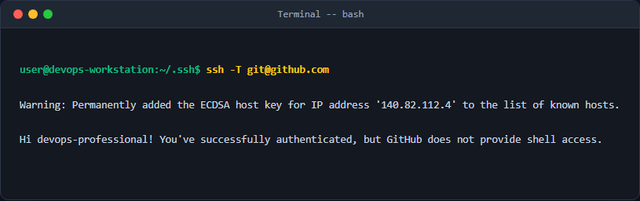
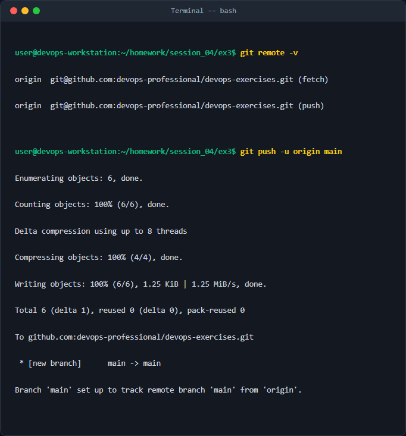

# Báo cáo kỹ thuật: Cấu hình xác thực SSH bằng Ed25519 và liên kết Git lên GitHub

## 1. Mục tiêu & Bối cảnh kỹ thuật
Trong quá trình phát triển phần mềm và vận hành DevOps, việc đẩy mã nguồn từ máy chủ cục bộ lên hệ thống Git Hosting (như GitHub, GitLab) là thao tác thường nhật. Tuy nhiên, việc sử dụng giao thức HTTPS kết hợp với mật khẩu hoặc Personal Access Token (PAT) thường gây phiền toái vì phải nhập lại thông tin xác thực nhiều lần, đồng thời tiềm ẩn rủi ro rò rỉ thông tin đăng nhập trong lịch sử dòng lệnh.

Để giải quyết triệt để vấn đề này, bài thực hành tập trung vào cấu hình **Xác thực phi đối xứng qua giao thức SSH (Secure Shell)** sử dụng thuật toán **Ed25519** (được khuyến nghị bởi tính bảo mật cao, kích thước khóa nhỏ, hiệu năng xử lý cực nhanh và chống lại các cuộc tấn công side-channel tốt hơn RSA truyền thống).

**Môi trường thực hiện:**
- Hệ điều hành: Ubuntu 22.04 LTS / Debian Linux / macOS.
- Công cụ: OpenSSH Client, Git Core CLI.
- Nền tảng lưu trữ từ xa: GitHub.

---

## 2. Các bước thực hiện chi tiết

### Bước 1: Khởi tạo cặp khóa SSH Ed25519 bảo mật
Chúng ta khởi tạo cặp khóa (Private Key và Public Key) bằng lệnh `ssh-keygen`. Thuật toán Ed25519 là lựa chọn mặc định tốt nhất hiện nay.

```bash
ssh-keygen -t ed25519 -C "devops-engineer@company.com" -f ~/.ssh/id_ed25519_github
```
*Giải thích tham số:*
- `-t ed25519`: Chỉ định thuật toán tạo khóa là Ed25519.
- `-C "devops-engineer@company.com"`: Thêm nhãn (comment) vào cuối khóa công khai giúp định danh chủ sở hữu.
- `-f ~/.ssh/id_ed25519_github`: Chỉ định đường dẫn lưu trữ và tên tệp tin của khóa (tránh ghi đè lên khóa mặc định `id_rsa` cũ nếu có).

*Hệ thống sẽ yêu cầu nhập `passphrase`. Đây là lớp mật khẩu mã hóa khóa private cục bộ để bảo vệ trong trường hợp máy tính cá nhân bị xâm nhập vật lý.*

### Bước 2: Đảm bảo quyền hạn an toàn cho tệp tin (File Permissions)
Đối với các tệp tin SSH nhạy cảm, Linux yêu cầu phân quyền tối thiểu để tránh bị các user khác trên hệ thống đọc trộm:
```bash
chmod 700 ~/.ssh
chmod 600 ~/.ssh/id_ed25519_github
chmod 644 ~/.ssh/id_ed25519_github.pub
```
*Giải thích:*
- `700`: Chỉ chủ sở hữu (owner) mới có quyền Đọc, Ghi, Thực thi trên thư mục `.ssh`.
- `600`: Chỉ chủ sở hữu mới có quyền Đọc, Ghi đối với Private Key.
- `644`: Khóa Public được phép chia sẻ công khai, ai cũng có thể đọc nhưng chỉ chủ sở hữu mới có quyền ghi.

### Bước 3: Cấu hình SSH Agent để quản lý khóa tự động
Khởi động SSH Agent chạy ngầm và đăng ký Private Key vừa khởi tạo để tránh việc phải nhập lại passphrase mỗi lần giao tiếp SSH:
```bash
eval "$(ssh-agent -s)"
ssh-add ~/.ssh/id_ed25519_github
```

Để hệ thống tự động nhận diện khóa này khi kết nối tới host `github.com`, ta tạo/chỉnh sửa file cấu hình `~/.ssh/config`:
```bash
nano ~/.ssh/config
```
Thêm nội dung cấu hình sau:
```text
Host github.com
  HostName github.com
  User git
  IdentityFile ~/.ssh/id_ed25519_github
  IdentitiesOnly yes
```

### Bước 4: Thêm Public Key lên tài khoản GitHub
1. Copy toàn bộ nội dung của Public Key:
   ```bash
   cat ~/.ssh/id_ed25519_github.pub
   ```
2. Truy cập vào tài khoản GitHub cá nhân -> **Settings** -> **SSH and GPG keys** -> **New SSH Key**.
3. Dán nội dung vừa copy vào phần **Key**, đặt tiêu đề (Title) tương ứng với máy tính đang sử dụng.

### Bước 5: Cấu hình liên kết Local Repository với GitHub Remote bằng SSH
Khởi tạo Git repository tại thư mục dự án cục bộ, commit các file cần thiết và tiến hành cấu hình Remote URL thông qua giao thức SSH:
```bash
# Khởi tạo repository nếu chưa có
git init

# Thêm tất cả file ngoại trừ file nhạy cảm được chỉ định trong .gitignore
git add .
git commit -m "feat: initialize project structures and configuration"

# Liên kết Remote Repository sử dụng giao thức SSH
git remote add origin git@github.com:devops-professional/devops-exercises.git

# Đổi tên nhánh mặc định thành main (chuẩn công nghiệp hiện đại)
git branch -M main

# Đẩy mã nguồn lên GitHub
git push -u origin main
```
*Giải thích tham số:*
- `-u origin main` (hoặc `--set-upstream`): Thiết lập liên kết theo dõi nhánh cục bộ `main` với nhánh `main` của remote `origin`. Các lần push/pull tiếp theo chỉ cần gõ `git push` hoặc `git pull` mà không cần chỉ định rõ đích đến.

---

## 3. Kiểm tra & Xác thực kết quả

### Kiểm tra kết nối SSH tới GitHub
Thực hiện kiểm tra kết nối để chắc chắn SSH Key hoạt động chính xác và GitHub đã chấp nhận danh tính:
```bash
ssh -T git@github.com
```


### Kiểm tra cấu hình remote URL cục bộ
Đảm bảo rằng remote đang sử dụng đường dẫn SSH thay vì HTTPS:
```bash
git remote -v
```


---

## 4. Kết luận & Best Practices bảo mật vận hành

1. **Luôn đặt Passphrase cho SSH Private Key:** Tuyệt đối không để trống passphrase khi tạo khóa trong môi trường làm việc thực tế nhằm ngăn chặn việc lộ lọt mã nguồn nếu máy tính bị đánh cắp dữ liệu.
2. **Sử dụng tệp tin `.gitignore` nghiêm ngặt:** Luôn khai báo các mẫu loại trừ để không bao giờ vô tình đẩy file private key, file `.env` hoặc thông tin nhạy cảm chứa credential lên GitHub.
3. **Mỗi thiết bị một cặp khóa riêng biệt:** Không chia sẻ hoặc di chuyển tệp private key (`id_ed25519`) qua các máy tính khác nhau. Mỗi máy tính/môi trường phát triển cần tạo một cặp khóa riêng biệt và đặt tên dễ nhận diện trên GitHub.
4. **Định kỳ kiểm tra các SSH Keys được liên kết:** Thực hiện rà soát danh sách SSH Keys trên tài khoản GitHub định kỳ để thu hồi ngay lập tức những khóa từ các thiết bị cũ hoặc không còn sử dụng.

## Ảnh chụp màn hình kết quả thực nghiệm

